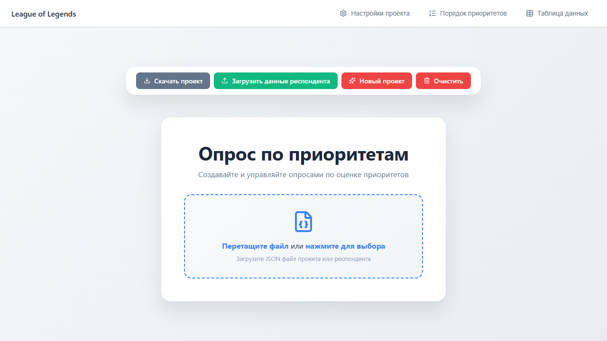
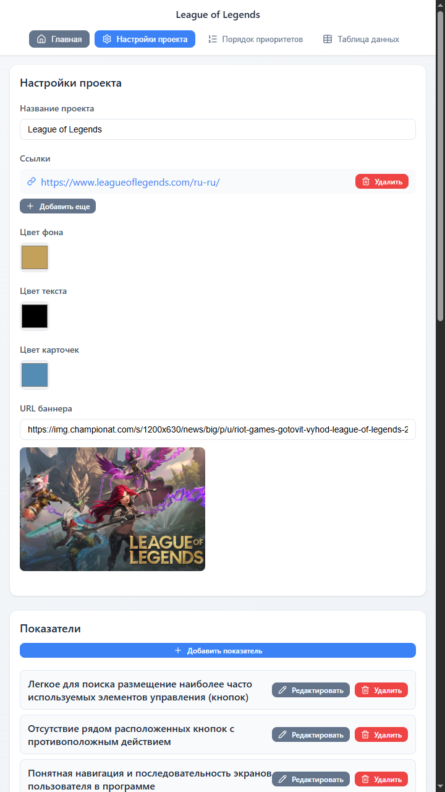
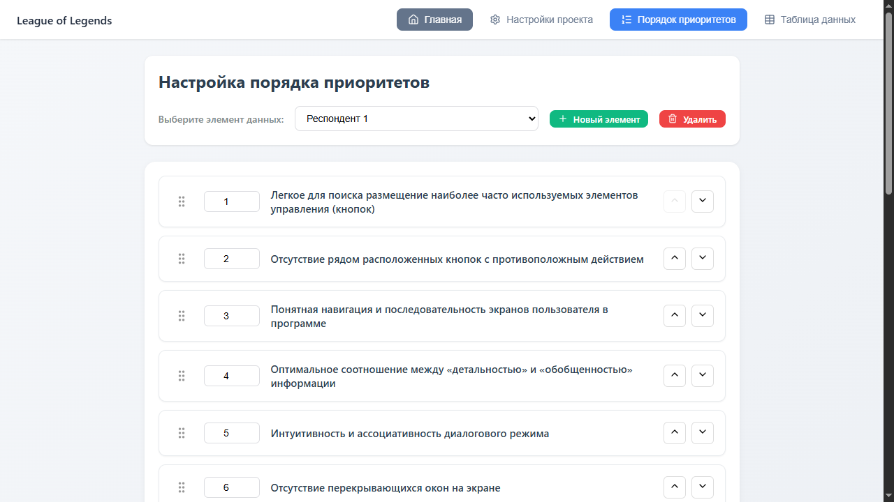
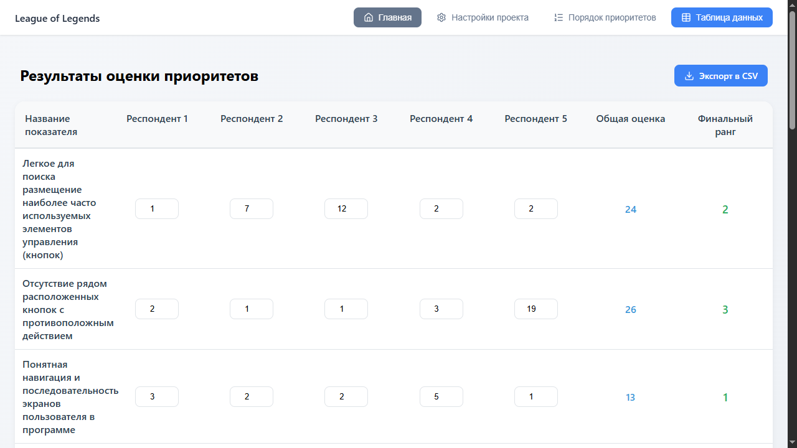
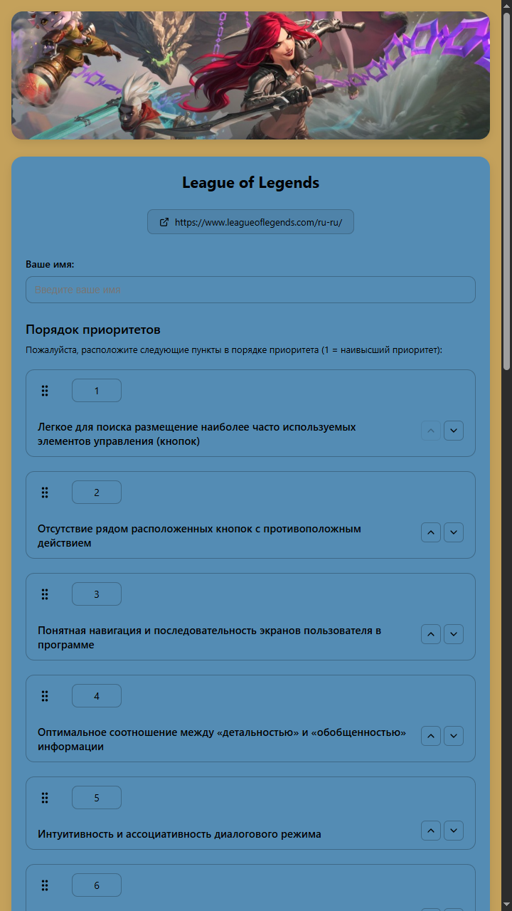

# Опрос по приоритетам

Веб-приложение для создания и проведения опросов по определению приоритетов. Позволяет администраторам создавать опросы, настраивать критерии, а респондентам - проходить опрос и определять приоритеты.

## Главная страница
Содержит зону drag&drop для загрузки данных проектов и ответов респондентов и панель быстрых действий (загрузка, экспорт, создание данных и проектов), а также навигацию по разделам активного проекта.

## Страница проекта
Содержит настройка параметров проекта, такие как: название, ссылки, цвета оформления, ссылка на баннер, список показателей, список респондентов, а также можно скачать файл-бланк для респондента.

  

## Страница приоритетов
Содержит настройку порядка приоритетов для каждого респондента.

## Страница данных
Таблица с показателями по респондентам включает сумму приоритетов и итоговую позицию на основе приоритетов. Таблицу можно экспортировать в формате CSV.

## Страница респондента
Содержит ввод имени и распределение приоритета показателей респондента. Страница оформлена в заданной теме проекта и по завершенный опрос формируется в файл ответов респондента.

  

